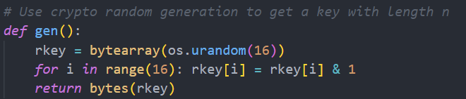
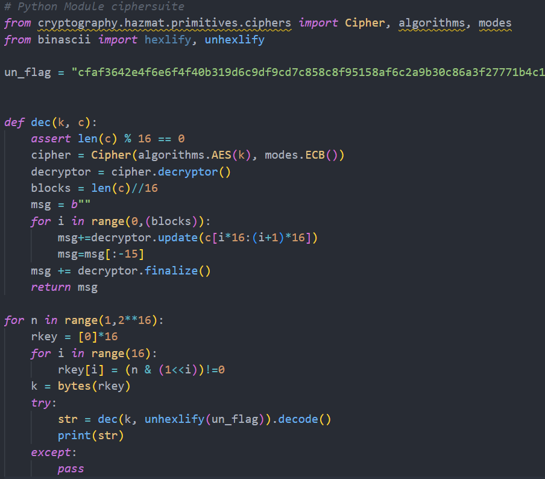

# CTF Extras

## British Punctuality

- Primeiro lendo o código no main.c, descobrimos que a flag estava escrita no ficheiro /flags/flag.txt

 

- Depois, reparámos que o script my_script.sh, exportava as variáveis de ambiente que estivessem no ficheiro /tmp/env, executava o comnado printenv e depois o programa reader. 

 

- Criamos um printenv na pasta /tmp/, com cat /flags/flag.txt, e demos lhe permissões de execução.
- Então criamos o ficheiro env e escrevemos "PATH=/tmp/:$PATH"

 

- Depois executamos o script e vimos que não tinhamos permissões para ler a flag
- Reparámos que havia um script no "/etc/cron.d/", que executava o script "/home/flag_reader/my_script.sh" como flag_reader (a cada minuto), portanto tinha permissões para ler a flag.
 

- Esperamos que o script executasse e lê-mos a flag do last_log .

 

 

## Final Format
Ao correr o comando checksec podemos verificar que:
- o RELRO é parcial, o que significa que podemos alterar a GOT
- o programa tem canarios na stack
- a protecao NX está ativa, o que significa que um segmento de memória não pode ser executável e ser permitido escrever ao mesmo tempo.
- o PIE não está ativo, o que significa que os endereços das funções não se alteram em cada execução

Ao analisar o código com o ghidra vericamos que o programa era vulnerável a format string attacks na linha 17.

E que existe uma função chamada old_backdoor, que cria uma shell. Uma vez que não tem PIE, o enderço da função não irá ser alterado a cada execução pelo que será sempre este endereço 0x8049236.

Ao enviar %p, verificamos que os endereços mudam em cada execução o que significa que a aslr está ativa, portanto não conseguimos descobrir o endereço de retorno da função para a conseguir alterar para o endereço do old_backdoor.

Depois, reparamos que os da got são fixos.

No código reparamos que o fflush era chamado depois do scanf, por isso se alterarmos o endereço dele na tabele para executar a backdoor em vez do fflush, ele irá ser chamado antes do programa terminar.

Ao correr o seguinte script reparamos que não funcionava, uma vez que o servidor dava timeout (no computador local funcionava direito)

Por isso tentamos escrever primeiro os 2 primeiros bytes e depois os outros 2 bytes. Uma vez que o numero da direita (0x9236)  era maior que o da esquerda (0x0804), tivemos q dar overflow ,para conseguir escrever o endereco pretendido (0x08049236).
Primeiro escrevemos 4 bytes(AAAA) que vao ser lidos pelo primeiro %x, depois escrevemos o endereco que queremos alterar (do flush na got, 0x804c010), onde vamos escrever os primeiros bytes com o primeiro %n.
Depois escrevemos outra vez 4 bytes(AAAA) que vão ser lidos (e descartados) pelo segundo %x, e escrevemos o endereco do content + 2, para escrever apenas nos 2 bytes a seguir (e não alterarmos os que já escrevemos antes) 

E assim já funcionou 

## NumberStation3
Observando o código fornecido, apesar da chave gerada ter 256 bits, de facto só existem 2^16 chaves possíveis, já que é feito um bitwise & com 1 para cada byte, ou seja, cada byte dos 16 que constituem a chave ou são iguais a 0 ou iguais a 1. 

Como tal, é possível testar todas as chaves possíveis (65536) em tempo útil e, para cada uma destas, tentar decifrar o criptograma. Uma destas será a chave verdadeira e o resultado será a mensagem original, ou seja, a flag

