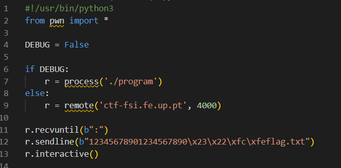

# pwn

* Semana 5 - Desafio 1

Existe algum ficheiro que é aberto e lido pelo programa?
O ficheiro mem.txt.

Existe alguma forma de controlar o ficheiro que é aberto?
Sim, através de um overflow de modo a dar overwrite à variável meme_file (onde é guardado o nome do ficheiro).

Existe algum buffer-overflow? Se sim, o que é que podes fazer?
Existe. O comando scanf está à espera de ler 28 caracteres do buffer existente, sendo que este foi gerado para um limite de 20 caracteres. Se preenchermos o buffer até ao seu limite (20 char), os restantes "darão" overwrite à variável meme_file, sendo o resultado deste processo seria a flag pretendida.  

* Semana 5 - Desafio 2

Que alterações foram feitas?
A existência de uma nova variável (val) que será usada para fazer uma posterior comparação, de modo a tentar mitigar um possível buffer-overflow.

Mitigam na totalidade o problema?
Não.

É possivel ultrapassar a mitigação usando uma técnica similar à que foi utilizada anteriormente?
Sim, com atenção ao valor novo introduzido. Do mesmo modo, temos aqui o uso do scanf para um número de caracteres superior ao limite do buffer.
Neste caso, basta preencher o buffer até ao limite, seguido do valor que validaria a comparação com a variável val, finalizando com "flag.txt".
Há que ter apenas em consideração que, como os inteiros são guardados em "little endian", a ordem como colocamos o valor para a comparação no script seria a inversa ao esperado (0xfefc2223), como se testemunha pelo seguinte código.

