# Trabalho Realizado nas Semanas #10 e #11

## Task 1  

- Tal como foi pedido, preenchemos o campo brief description no perfil de um user com código JavaScript, de modo a dar display de um simples alert, aquando de uma visita ao perfil.

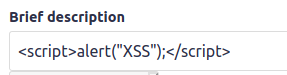

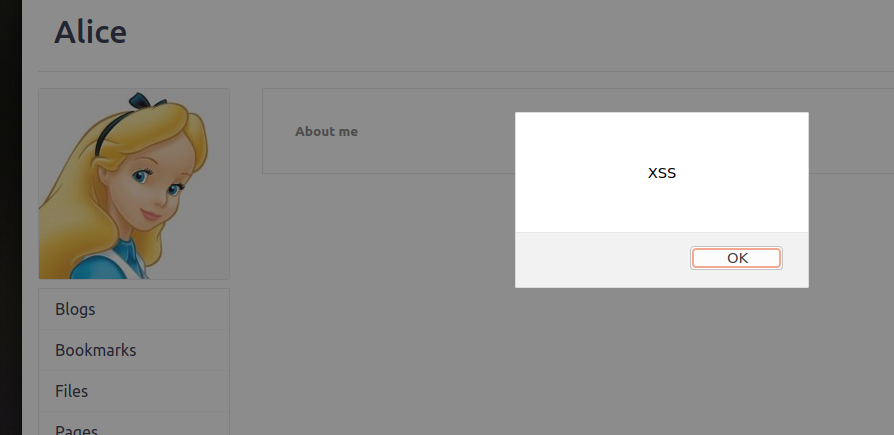

## Task 2  

- Tal como na tarefa 1, inserimos um script no mesmo campo, mas desta vez de modo a dar display dos cookies relativos à sessão do user, aquando de uma visita ao perfil.

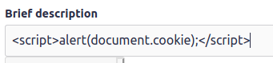

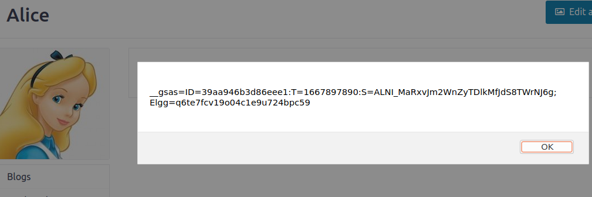

## Task 3  

- Nesta tarefa, queremos ter acesso às cookies de um user sem precisar de visitar o seu perfil. Para isso, recorre-se a um script (no campo brief description, por exemplo), que um HTTP request para nós.
- Através da adição de um elemento img, quando o browser tentar carregar os dados nela contidos, o request é enviado.
- Por fim, usamos o comando nc (netcat) que revela informação enviada no port especificado. 

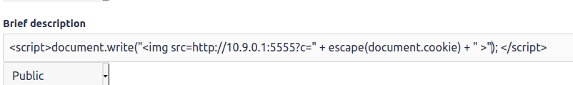

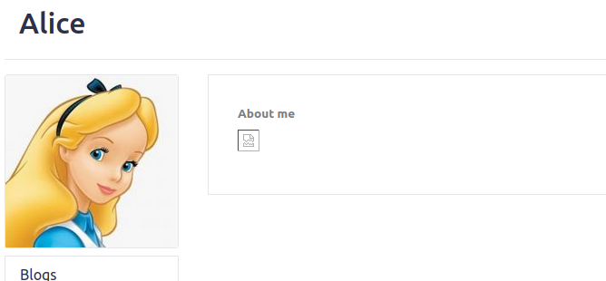

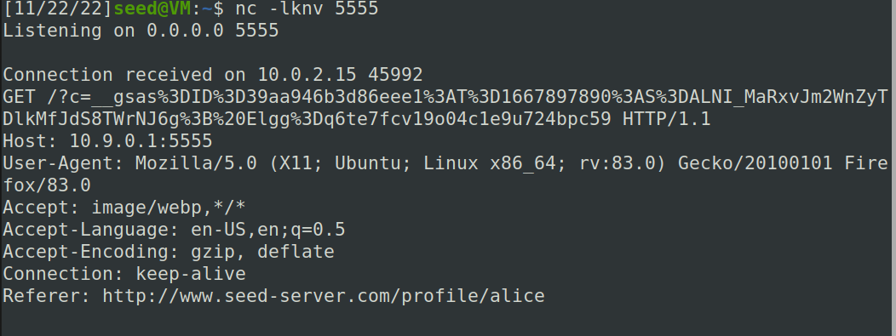

## Task 4  

- Nesta tarefa, pretendemos que quem visite o perfil do user Samy adicione-o como amigo automaticamente.
- Para isso, podemos colocar um script na secção About me do perfil do Samy (em Text mode).

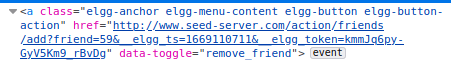

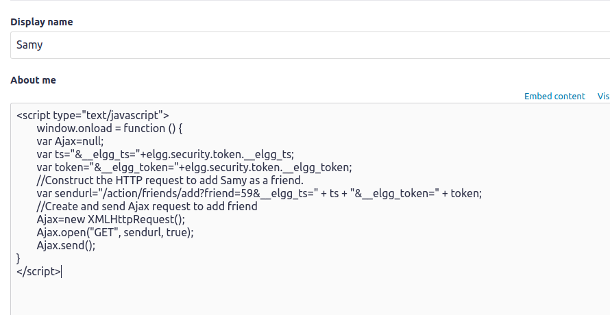

- Conseguimos assim criar e enviar um request Ajax, aproveitando-nos da informação no campo de action no form relativo à adição como amigo de um user.
- **Resposta à questão 1:** De modo a prevenir ataques de request forgery, qualquer action que se pretenda fazer na plataforma em questão requere a passagem de um CSRF token. Neste caso, a linha 1 contém informação de uma timestamp atual e, por sua vez, a linha 2 contém o token gerado a partir desse timestamp. Assim, para que a action seja permitida, temos de recolher os dados do token (linhas 1 e 2) (por exemplo, usando JavaScript), sendo que essa proteção não irá impedir o nosso script de executar e fazer o pretendido.
- **Resposta à questão 2:** Sim, seria possível executar um ataque bem sucedido; bastaria alterar o código HTML, adaptando-o de modo a permitir aquilo que pretendemos.

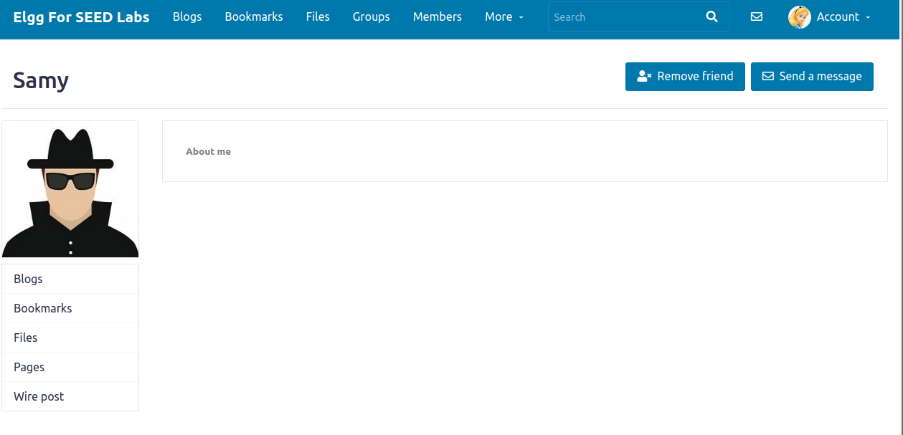

# CTF-Week10

## Semana 10 - Desafio 1

#### Verifica se existe alguma vulnerabilidade no formulário de submissão da justificação. Qual é?
- O texto neste formulário não é filtrado de todo quando é guardado na base de dados nem quando é mostrado ao utilizador, sendo possível realizar stored XSS.

#### Consegues usá-la para que o teu pedido seja aprovado? 
- É possível colocar código que manipula o DOM de forma a clicar no botão desativado que devolve a flag.
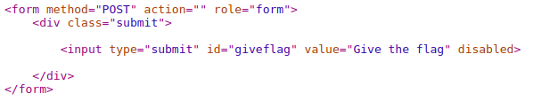
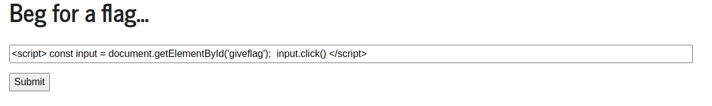
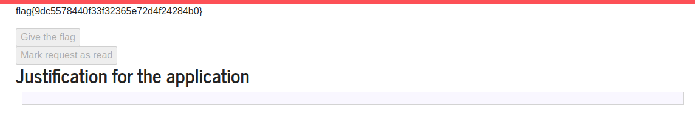

## Semana 10 - Desafio 2

#### Que funcionalidades é que estão acessiveis a um utilizador sem este estar autenticado?
- Tentar fazer log-in, um speed report e dar ping a um host fornecido pelo utilizador

#### Das funcionalidade que identificaste e do feedback que tiveste da sua utilização, pensa como é que estas podem estar implementatadas no servidor. Será que estão a utilizar algum utilitário linux?
- Como o host é fornecido pelo utilizador, este input tem de ser usado em algum comando para dar ping a esse host.
- Sim, provavelmente estão a utilizar algum utilitário Linux já que a resposta ao ping é a típica de um ping feito num utilitário Linux.
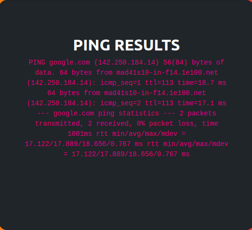

#### Se sim, que vulnerabilidades podem estar presentes na chamada deste utilitário?
- Caso este input não seja filtrado, é possível executar fazer injeção de instruções na shell onde o ping é executado.

#### Verifica se existe alguma vulnerabilidade nesta funcionalidade. Identificada a vulnerabilidade, utiliza-a para aceder à flag que se encontra no ficheiro /flags/flag.txt.
- Tal como previsto, este input não é de facto filtrado. Como tal, é possível realizar um cat da flag cujo resultado é devolvido em conjunto com o ping.

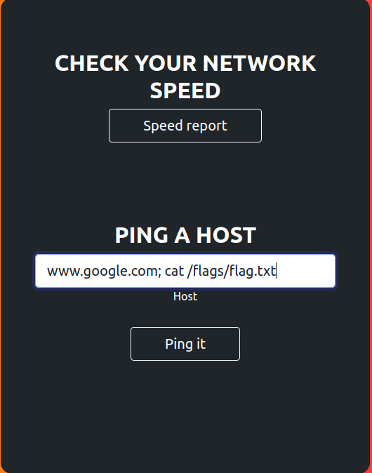
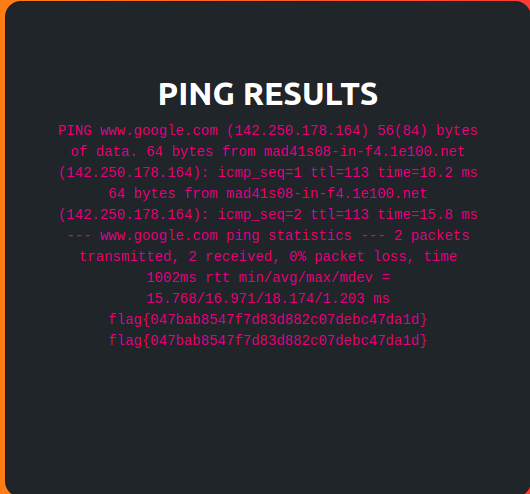

