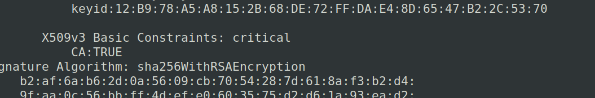
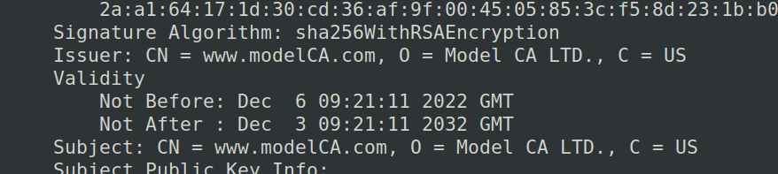
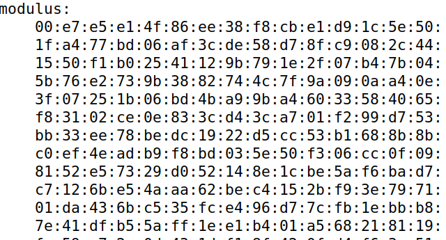
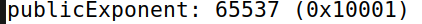
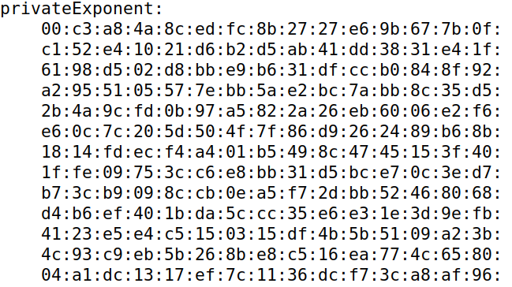
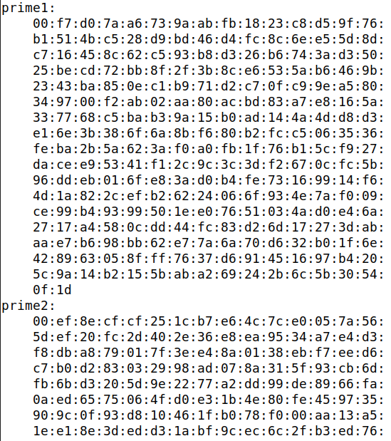

# Trabalho Realizado nas Semanas #12 e #13

## Task 1  

- Que parte do certificado indica que é um certificado CA? Como podemos ver, a extensão CA está definida como TRUE.

- Que parte do certificado indica que é um certificado "self-signed"? Na secção onde é possível encontrar o subject e o issuer, reparamos que estes coincidem, logo o certificado é "self-signed".

- No algoritmo RSA, temos um expoente público e, um expoente privado d, um módulo n, e dois números secretos p e q, tal que n = pq. Identifica os valores para estes elementos no teu certificado e ficheiros chave.

**módulo n:**

**expoente público e:**

**expoente privado d:**

**números secretos p e q:**

## Task 2  

- 

## Task 3  

- 

## Task 4  

- 

## Task 5  

- 

## Task 6  

- 

# CTF

## Semanas #12 e #13 - Desafio 1

- 

## Semanas #12 e #13 - Desafio 2

- 

