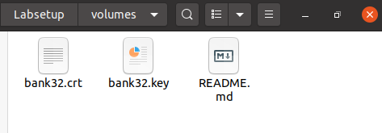
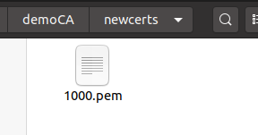
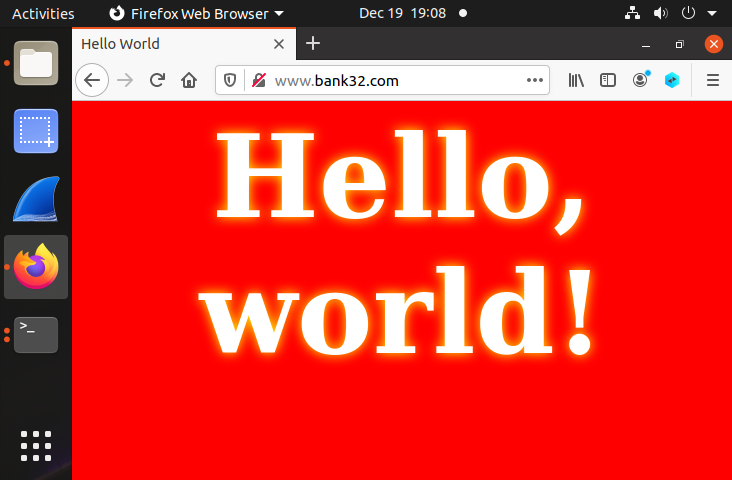

# Trabalho Realizado nas Semanas #12 e #13

## Task 1  

- Que parte do certificado indica que é um certificado CA? Como podemos ver, a extensão CA está definida como TRUE.

- Que parte do certificado indica que é um certificado "self-signed"? Na secção onde é possível encontrar o subject e o issuer, reparamos que estes coincidem, logo o certificado é "self-signed".

- No algoritmo RSA, temos um expoente público e, um expoente privado d, um módulo n, e dois números secretos p e q, tal que n = pq. Identifica os valores para estes elementos no teu certificado e ficheiros chave.

**módulo n:**  

**expoente público e:**  

**expoente privado d:**  

**números secretos p e q:**  

## Task 2  

- Aqui se segue o comando criado para gerar um CSR para o server especificado, juntamente com a opção adicional, adicionando-se dois nomes alternativos ao CSR.

## Task 3  

- Após assinar o certificado e executar o comando proposto que dá print ao conteúdo decodificado do certificado, podemos verificar que os nomes alternativos estão, de facto, incluídos.

## Task 4  

- 

## Task 5  

- 

## Task 6  

- 

# CTF

## Semanas #12 e #13 - Desafio 1
Utilizando o site https://www.numberempire.com/primenumbers.php, encontramos p e q (primeiro primo maior que 2^512 e primeiro primo maior que 2^513, respetivamente).
- p =13407807929942597099574024998205846127479365820592393377723561443721764030073546976801874298166903427690031858186486050853753882811946569946433649006084171
- q =26815615859885194199148049996411692254958731641184786755447122887443528060147093953603748596333806855380063716372972101707507765623893139892867298012168351  
 De seguida, sabendo que (d * e) mod ((p-1) * (q-1)) = 1 e que o valor de e é padrão - 0x10001, calculamos d utilizando a seguinte expressão:
- pow(e,-1,(p-1)*(q-1))
Utilizando este valor, basta utilizar a função dec fornecida para descodificar o criptograma.

## Semanas #12 e #13 - Desafio 2
- Após alguma pesquisa, descobrimos (em https://infosecwriteups.com/rsa-attacks-common-modulus-7bdb34f331a5) que quando a mesma mensagem é cifrada duas vezes com os mesmos números primos p e q mas dois e's diferentes, é possível recuperar a mensagem original se tivermos acesso aos dois criptogramas resultantes, ao n e aos dois e's (todos fornecidos neste desafio), utilizando o teorema de Bezout.
- Para isto, basta descobrir dois números a e b, utilizando o teorema de Bezout, tal que a * e1 + y * e2 = 1, em que e1 e e2 são os dois e's utilizados na encriptação.
- Após isto, é possível provar que, módulo n:
- c1^a * c2^b = M, em que c1 corresponde ao criptograma 1, c2 corresponde ao criptograma 2 e M corresponde à mensagem original.
- Como tal, basta calcular c1^a*c2^b (módulo n) para obter a mensagem original (ou seja, a flag).

