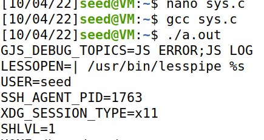
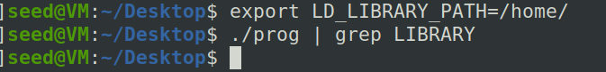

# Trabalho realizado na Semana #4

## Task 1

- Recorrendo inicialmente ao comando printenv, podemos saber qual a working directory ocorrente (PWD)
- Se gerarmos uma variável de ambiente, teríamos primeiro de recorrer ao comando export de modo a que a variável seja reconhecida e revelada através do uso do printenv
- Por outro lado, se usarmos o comando unset (para a respetiva variável), esta não é mais reconhecida pelo que o comando printenv já não revela a sua informação

## Task 2

- O programa myprintenv.c é responsável por mostrar as variáveis de ambiente no processo pai e no processo filho, após uma chamada do comando fork()
- Através da execução do programa, concluímos que o processo filho herda as variáveis do pai, sendo que não há diferença entre os outputs de um lado e do outro

- Alteramos ligeiramente o código de modo a saber o output quer do processo pai, quer do processo filho

## Task 3

- Tal como descrito, com o uso do comando execve(), não se gera um novo processo; em vez disso, o programa é executado dentro do processo que o "chama"
- Concluímos que, atribuindo as variáveis de ambiente ao terceiro argumento do comando execve(), a sua informação é passada e, deste modo, o programa revela as variáveis na stream de output

- O comando env mostra-nos as variáveis de ambiente
- Com a execução do terceiro argumento como NULL não surge nenhum output
- Por outro lado, passando as variáveis nesse argumento, elas já serão reveladas ao chamar o comando env

## Task 4

- Ao usarmos o comando system(), há um pedido à shell para executar o comando em questão, sendo que, eventualmente, o comando execve() é chamado, com a informação das variáveis de ambiente
- Ao testar o programa, verifica-se, de facto, que as variáveis de ambiente são passadas e surgem todas na stream de output aquando do pedido

## Task 5

- Um programa SET-UID assume os privilégios do seu owner, pelo que se o owner for root, o programa ganharia os privilégios associados
- Os comportamentos deste tipo de programas são determinados pela sua lógica, não pelo user, mas o user pode-se aproveitar das variáveis de ambiente para afetar o programa
- Ao testar o programa, verifica-se que o user pode definir uma variável de ambiente e confirmar que esta foi passada aquando da execução do programa SET-UID (esta surge no output)
- Apesar de quase todas as variáveis de ambiente declaradas pelo user serem passadas para o programa, o mesmo não acontece com a LD_LIBRARY_PATH. Isto é uma medida de proteção para utilizadores maliciosos não conseguirem alterar quais as bibliotecas que são importadas (de forma a importar as suas em vez das esperadas) 

## Task 6

- Podemos alterar, em Bash, a variável de ambiente PATH e executar, posteriormente, uma chamada ao system() (onde é feito o pedido à shell e passam-se variáveis) com o comando ls
- O programa usa o path relativo no comando ls e não o path absoluto
- Como se recorreu ao system() com o comando ls, para a execução do comando, é feita uma pesquisa do ls pelas pastas do PATH até que se encontre o executável associado ao ls 
- Deste modo, com a alteração prévia da variável de ambiente PATH, podemos manipular o processo, de forma a que a chamada ao ls execute o nosso programa (ls) em vez de executar o ls do /bin (o que seria de esperar), para um programa SET-UID com permissões de root, tal como se verificou

# CTF-Week4: Web
* Após procurar informação relevante para o ataque pretendido ao website, encontramos a versão de wordpress e dos plugins instalados  
.
  e ainda dois utilizadores: Admin e Orvald Sanford
* Depois, procuramos vulnerabilidades nos plugins e no wordpress nas versões usadas. Após isto, encontramos uma vulnerabilidade que permitia autenthication bypass na versão 5.4.3 do Booster for WooCommerce (CVE-2021-34646)
* Após isto, procuramos um exploit para esta vulnerabilidade, que encontramos no exploit.db, [aqui](https://www.exploit-db.com/exploits/50299).
* Seguimos os passos explicados neste site e conseguimos dar log in com a conta de admin identificada previamente. Após isto, navegamos para o link fornecido que tinha a flag.

