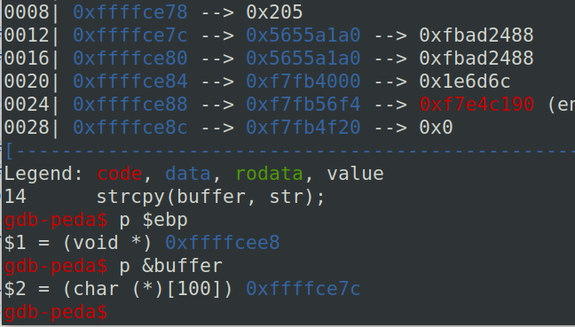
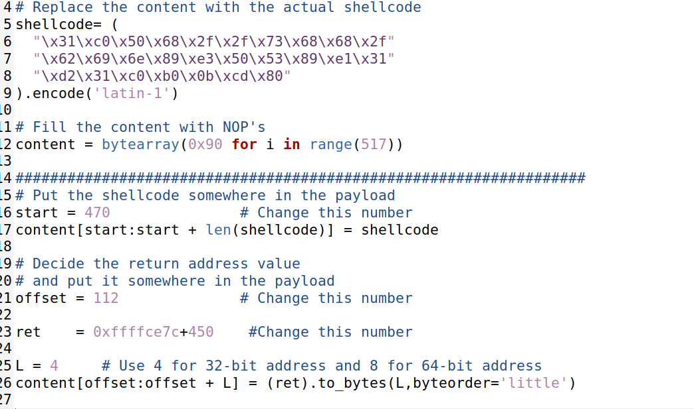
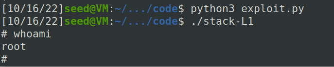
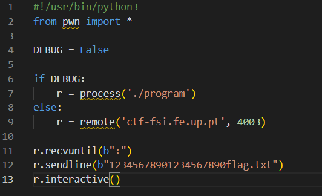
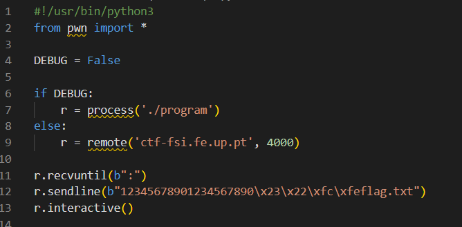

# Trabalho realizado na Semana #5

## Task 1

- Com esta task aprendemos que é possível pôr o código binário de um programa (malicioso ou não) num buffer na stack e executá-lo. Neste caso nós temos uma shell code que executa uma shell, tal como é verificável na imagem abaixo. 

  

## Task 2  

- Este programa lê 517 bytes de um ficheiro e copia-os para um buffer de apenas 100 bytes sem qualquer verificação. Como tal, os 417 bytes restantes podem ser escritos por cima do resto da stack (fora do espaço alocado para o buffer), mudando possivelmente outras variáveis locais, o endereço de retorno, os argumentos, o frame pointer, etc.
- Há que ter em conta que, aquando da compilação, são desativadas configurações relativas a proteção de stack e é definida a ownership do programa como root bem como a passagem deste para um SET-UID. 

## Task 3

- Nesta tarefa, o importante seria descobrir o offset entre a posição inicial do buffer e o local onde é guardado o endereço de retorno.
- Com o gdb, ao realizarmos debugging obtivemos os endereços do ebp e do buffer, cuja distância é de 108 bytes. O endereço de retorno encontra-se imediatamente a seguir ao ebp, pelo que será preciso considerar uns extra 4 bytes; ao todo, um offset de 112.
- Ao correr o programa com o gdb, há variáveis adicionais na stack e, portanto, o endereço que obtivemos do frame pointer terá um desfasamento ligeiro em relação a quando se corre o executável por si no terminal (o executável tem um valor superior).
- Com isto, a shell code é escrita o mais longe possível da stack e o endereço de retorno é, do mesmo modo, bastante maior, para serem maiores as chances de esta calhar na zona dos NOPs.
- Ao explorar esta vulnerabilidade foi possível correr uma shell de owner root.

# CTF-Week5: pwn

* Semana 5 - Desafio 1

Existe algum ficheiro que é aberto e lido pelo programa?
O ficheiro mem.txt.

Existe alguma forma de controlar o ficheiro que é aberto?
Sim, através de um overflow de modo a dar overwrite à variável meme_file (onde é guardado o nome do ficheiro).

Existe algum buffer-overflow? Se sim, o que é que podes fazer?
Existe. O comando scanf está à espera de ler 28 caracteres do buffer existente, sendo que este foi gerado para um limite de 20 caracteres. Se preenchermos o buffer até ao seu limite (20 char), os restantes "darão" overwrite à variável meme_file, sendo o resultado deste processo seria a flag pretendida.  

* Semana 5 - Desafio 2

Que alterações foram feitas?
A existência de uma nova variável (val) que será usada para fazer uma posterior comparação, de modo a tentar mitigar um possível buffer-overflow.

Mitigam na totalidade o problema?
Não.

É possivel ultrapassar a mitigação usando uma técnica similar à que foi utilizada anteriormente?
Sim, com atenção ao valor novo introduzido. Do mesmo modo, temos aqui o uso do scanf para um número de caracteres superior ao limite do buffer.
Neste caso, basta preencher o buffer até ao limite, seguido do valor que validaria a comparação com a variável val, finalizando com "flag.txt".
Há que ter apenas em consideração que, como os inteiros são guardados em "little endian", a ordem como colocamos o valor para a comparação no script seria a inversa ao esperado (0xfefc2223), como se testemunha pelo seguinte código.

# Extra

## British Punctuality

- Primeiro lendo o código no main.c, descobrimos que a flag estava escrita no ficheiro /flags/flag.txt
 
- Depois, reparámos que o script my_script.sh, exportava as variáveis de ambiente que estivessem no ficheiro /tmp/env, executava o comnado printenv e depois o programa reader.
 
- Criamos um printenv na pasta /tmp/, com cat /flags/flag.txt, e demos lhe permissões de execução.
- Então criamos o ficheiro env e escrevemos "PATH=/tmp/:$PATH"
 
- Depois executamos o script e vimos que não tinhamos permissões para ler a flag
- Reparámos que havia um script no "/etc/cron.d/", que executava o script "/home/flag_reader/my_script.sh" como flag_reader (a cada minuto), portanto tinha permissões para ler a flag.
 
- Esperamos que o script executasse e lê-mos a flag do last_log .
 

