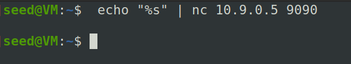
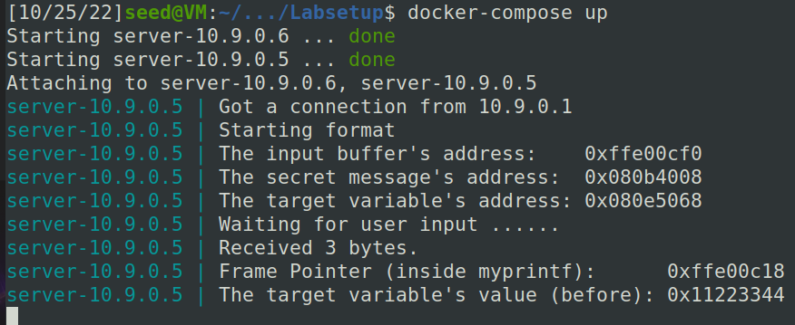

# Trabalho Realizado na Semana #6

## Task 1
O objetivo nesta task é fazer o programa crashar.

Nós enviamos o seguinte input "%s" para o server e conseguimos crashar o programa, como se vê no print a seguir.

Isso acontece uma vez que o printf vai tentar escrever o texto e não foi dada nenhum ponteiro válido para ele ler.

## Task 2  

- 

## Task 3

- 

