# Trabalho Realizado na Semana #6

## Task 1

- O objetivo nesta task é fazer o programa crashar.

- Nós enviamos o seguinte input "%s" para o server e conseguimos crashar o programa, como se vê no print a seguir.

- Isso acontece uma vez que o printf assume que tem como parâmetro um endereço de memória para o endereço base de uma string. No entanto, nenhum parâmetro é passado à função printf e, como tal, é lido um endereço fora do espaço virtual do processo, o que causa que o programa crashe.

## Task 2  

### 2.A

- Por tentativa erro, fomos adicionando %x até ao output conter no seu final "41414141" que corresponde a 4 'A's representados em ASCII, em hexadecimal. Concluimos que são necessário 64 %x.
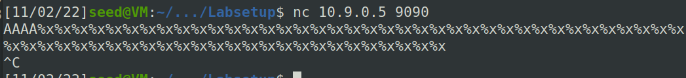
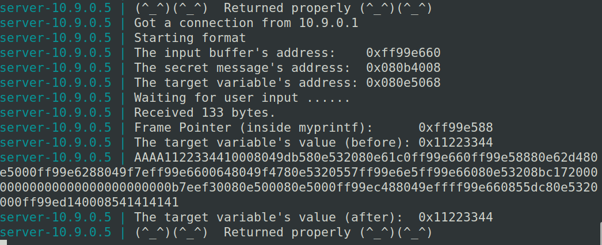

### 2.B 

- Sabendo que é necessário um offset de 63 '%x' para chegar ao início do nosso input, se no início colocarmos um endereço de memória e depois dos 63 '%x' colocarmos um '%s', a string vai ser lida do endereço que está no início do nosso input e, assim, o output vai ser a string nesse endereço. Assim, basta colocar o endereço fornecido pelo servidor no início do input, seguido de 63 '%x' e de um '%s' (como foi feito no script python)

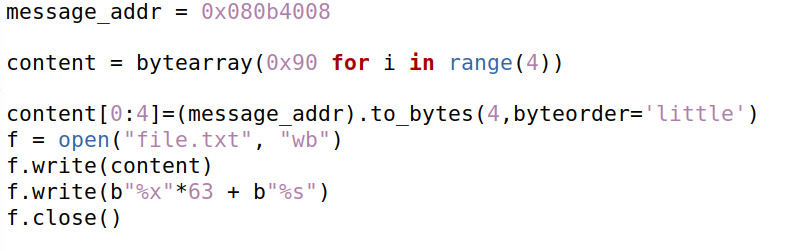
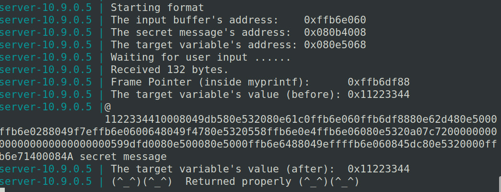

## Task 3
### 3.A

- Desta vez, queremos que o endereço lido para o '%n' seja o endereço no início do nosso input, correspondente ao endereço da variável target fornecido pelo servidor. Para isso, necessitamos de colocar esse mesmo endereço, seguido de 63 '%x' e, por fim, um '%n', como foi feito no script de python.
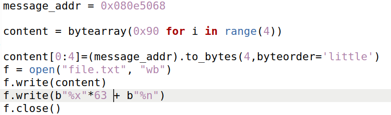
- Já que o '%n' corresponde a guardar na variável dada como parâmetro (neste caso, o target) o número de caratérs escritos até esse instante, esse mesmo número (0xEE) é guardado no target. Isto é verificável pelo output do servidor.
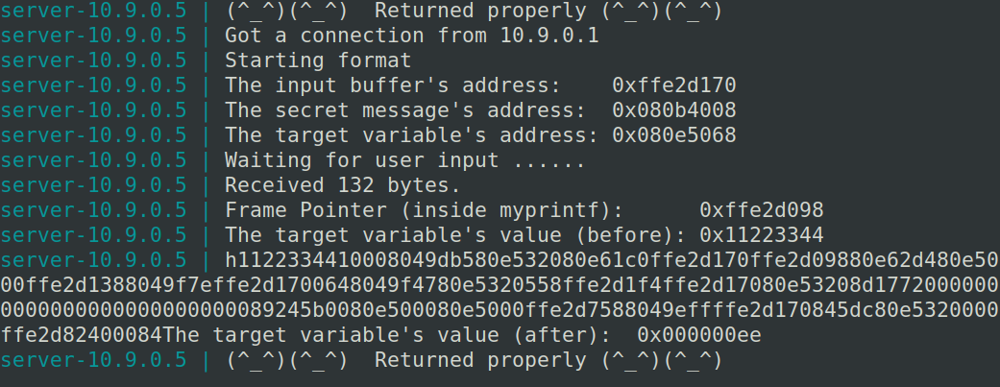

### 3.B 

- Sabendo que na alínea a deste mesmo exercício foram lidos 238 caratérs (0xEE), então é necessário escrever mais 20242(0x5000-0xEE) caratérs antes do '%n'. Para tal, após o endereço do target, em vez de adicionarmos os 63 '%x' adicionamos 62 '%x' sem quaisquer alterações e um '20244%x' (20242 + os dois caratérs que o último '%x' escrevia), seguido do '%n', como foi feito no script python.
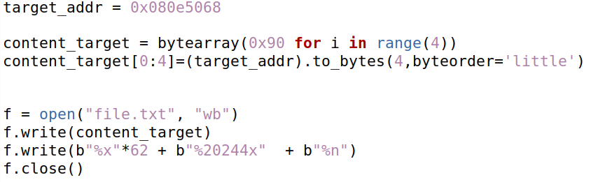
- O resultado é verificável pelo output do servidor
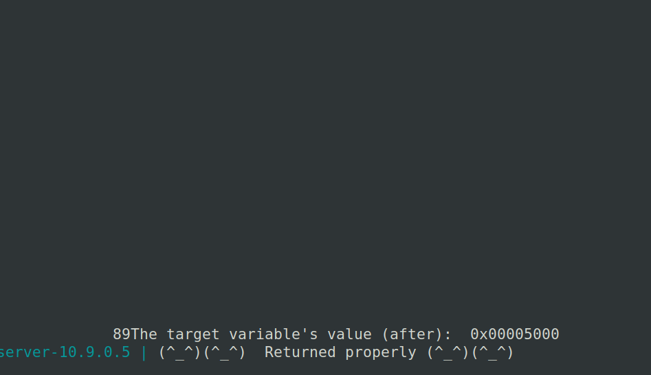

# CTF-Week7: pwn

## Semana 7 - Desafio 1

- Correndo o checksec, inferimos que são as várias as proteções ativas de relevo no nosso contexto, nomeadamente, as de Partial RELRO e NX (não se pode injetar código na stack e executá-lo) e Canary (dificulta a operação de buffer overflow). Por outro lado, verifica-se "No PIE", o que significa que não é efetuada a randomization de endereços de memória.

Qual é a linha do código onde a vulnerabilidade se encontra?
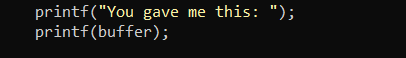  

O que é que a vulnerabilidade permite fazer?  
Permite, através do uso de caracteres como %x, %s e %n, ver e alterar a memória do programa em questão.

Qual é a funcionalidade que te permite obter a flag?  
Conseguimos, através desta vulnerabilidade, ler a informação de qualquer posição de memória.  

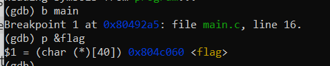  

- Tirando proveito do gdb, identificamos o endereço correspondente à flag, de modo a expôr posteriormente o conteúdo lá presente.  
- Recorrendo à adição de vários %x, apercebemo-nos que a input string se localizava logo no início. Tendo isso em conta, escrevemos o endereço do buffer da flag acompanhado de um %s, imprimindo a flag no stdout.  

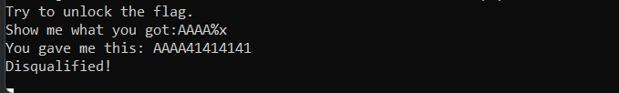  
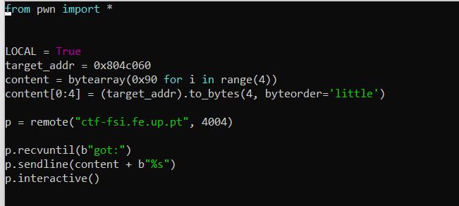  
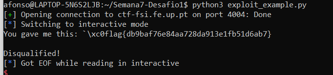  

## Semana 7 - Desafio 2

- Correndo o checksec, inferimos que são as várias as proteções ativas de relevo no nosso contexto, nomeadamente, as de Partial RELRO e NX (não se pode injetar código na stack e executá-lo) e Canary (dificulta a operação de buffer overflow). Por outro lado, verifica-se "No PIE", o que significa que não é efetuada a randomization de endereços de memória.

Qual é a linha do código onde a vulnerabilidade se encontra? 

* O que é que a vulnerabilidade permite fazer?
Permite, através do uso de caracteres como %x, %s e %n, ver e alterar a memória do programa em questão..
* A flag é carregada para memória? Ou existe alguma funcionalidade que podemos utilizar para ter acesso à mesma?  
Não. Temos de obter uma shell e fazer cat para ler o conteúdo da flag.
* Para desbloqueares essa funcionalidade o que é que tens de fazer?
Temos de alterar o valor da variável key para 0xbeef.
- Tirando proveito do gdb, identificamos o endereço correspondente à key, de modo a alterar posteriormente o conteúdo lá presente.  
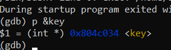
- Recorrendo à adição de vários %x, apercebemo-nos que a input string se localizava logo no início. Tendo isso em conta, escrevemos 4 bytes (que serão lidos pelo '%x'), o endereço de memória da key, '%48871x' (48871 = 0xbeef - 8 bytes, 4 dos primeiros 4 bytes e 4 do endereço da key) e %n. Como tal, são escritos 0xbeef caratérs antes de chegar ao %n, o valor da key é alterado para este valor, o código dentro do if passa a ser executado e é lançada uma shell. Após isto, basta executar o comando cat flag.txt 
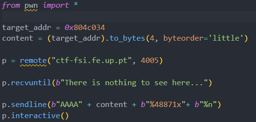
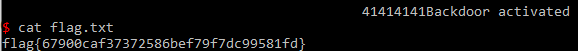

